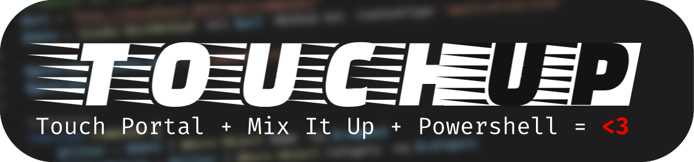

TouchUp combines PowerShell & MixItUp API functionality all into one easily configurable automated .ps1 script that you can use with Touch Portal.

### Pre-requisites
- [Touch Portal](https://www.touch-portal.com/)
- [Mix It Up](https://mixitupapp.com/)
- PowerShell

## **Parameters** 
---
You need the required ones to run the script. (Or you can edit them in the script file, but do so at your own risk)

| Parameter    | Usage        | String  | Required
|------------------|-|-| -|
| **-command** | `String` | [See Commands](#Commands) | true
| **-category**| `String` |[See Categories](#Categories) | true
| **-generate** | `Switch` |  | optional

## Commands

To see your command names open up commands.bat. This will autogenerate a .txt file containing your command names.

Alternatively, you can generate a commands.txt file with the `-generate` parameter.

`WARN` - Make sure not to name your commands on Mix It Up the same.

## Categories
|Selectors|| | |
|--|-|-|-|
|Interactive|Chat|Pre-Made|Interactive|

## **Getting Started**
---
- Add a button to your grid on Touch Portal
- Select **Run PowerShell Script** under **Run**
- Browse for the file: `portalitup.ps1`
- In the area called **Command Line params**
    - Enter: `-command Usage -category Usage`
- Test out a command by tapping on the button you assigned the script to.

## Big Thanks
---
Thank you to the Mix It Up and Touch Portal communities for making awesome tools.

## Contribute to the Code

If you would like to contribute to the code, submit a pull request, or alternatively contact me on the official Touch Portal [Discord](discord.gg/MgxQb8r)

Discord Tag: Cheese#1337